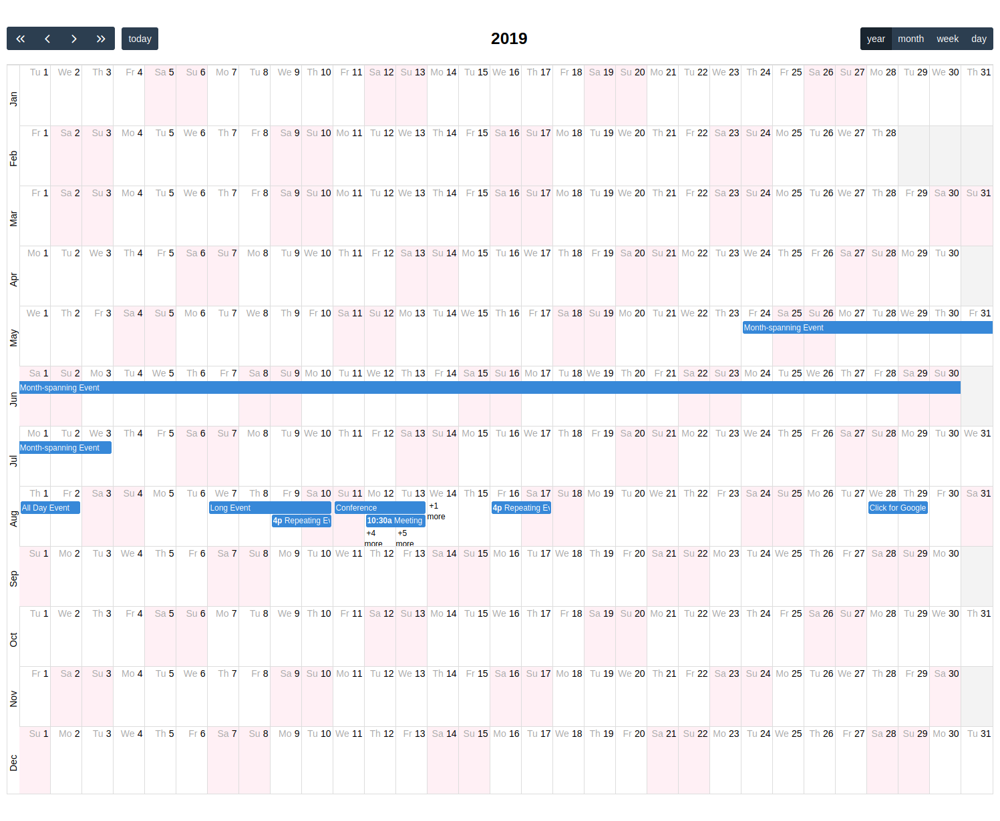

# FullCalendar Year View
This is a plugin for the well-known [FullCalendar library](https://fullcalendar.io) that shows a full year in a grid
where each row is a month. While this view certainly needs a big screen, I find it particularly useful for displaying
corporate events, school holidays or project timelines.

## How to use
Have a look at the example file. You will need to load [moment](https://momentjs.com/), the js file and the css file
after the core FullCalendar files.

## Notes
The code is basically a fork of the original FullCalendar DayGrid plugin with changes to achieve a full year display.
The current version is based on FullCalendar 4.3.1. It may or may not work with other versions of FullCalendar.
